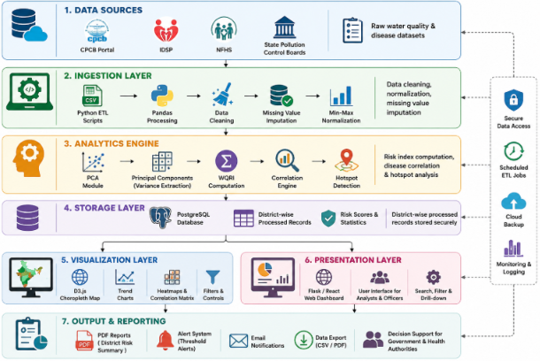
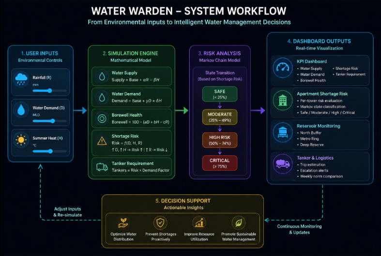
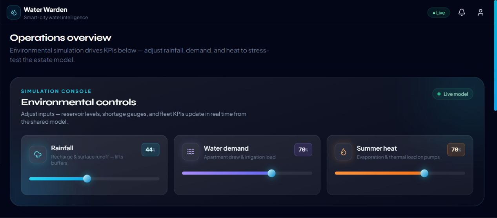
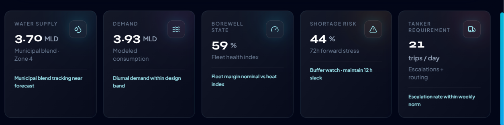
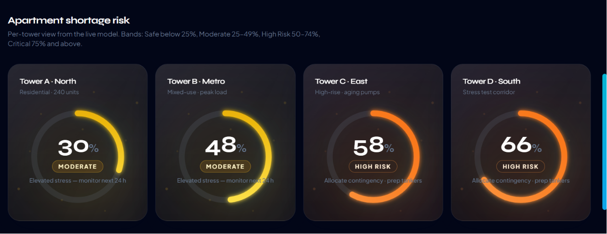
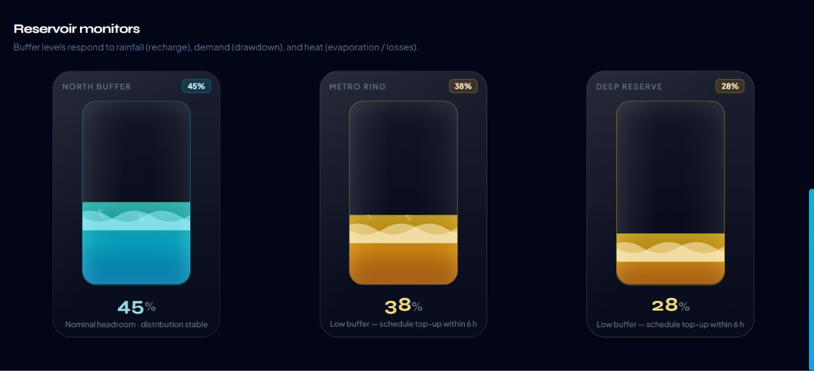

# 💧 Water Warden

> Smart Borewell Intelligence & Water Shortage Prediction Platform

Water Warden is an interactive smart-city dashboard that simulates apartment water management using mathematical modeling and environmental parameters. The application predicts water availability, shortage risk, borewell health, and tanker requirements in real time based on changing environmental conditions.

---

## 📖 Overview

Rapid urbanization and climate variability have made efficient water management a major challenge for residential communities. Water Warden addresses this problem by providing a simulation-driven decision support system capable of modeling water distribution under varying rainfall, demand, and temperature conditions.

Instead of relying on static dashboards, Water Warden dynamically updates all system metrics whenever environmental parameters change, allowing users to visualize how different scenarios affect overall water availability.

---

## ✨ Features

- 🌧️ Live environmental simulation
- 💧 Dynamic water supply prediction
- 🏢 Apartment shortage risk analysis
- 🚰 Reservoir monitoring dashboard
- 🚛 Tanker requirement estimation
- 📊 Interactive KPI cards
- 📈 Real-time mathematical simulation
- 🎨 Modern glassmorphism UI
- ⚡ Smooth animations using Framer Motion
- 📱 Responsive dashboard design

---

# 🧮 Mathematical Model

The simulation is based on a deterministic environmental model where three primary variables influence the system:

- Rainfall (R)
- Water Demand (D)
- Summer Heat (H)

These variables are transformed into operational metrics using mathematical equations.

### Water Supply

Supply increases with rainfall while decreasing with heat.

```
Supply = Base + αR − βH
```

---

### Water Demand

Demand increases according with user consumption and temperature.

```
Demand = Base + γD + δH
```

---

### Borewell Health

Borewell condition decreases under excessive demand and high temperature.

```
Borewell = 100 − (aD + bH − cR)
```

---

### Shortage Risk

Risk is computed from environmental stress.

```
Risk = f(D, H, R)
```

Higher demand and temperature increase risk, whereas rainfall reduces it.

---

### Tanker Requirement

```
Tankers = Risk × Demand Factor
```

As shortage risk increases, additional tanker trips are recommended.

---

## 🏗️ System Modules

### Module 1 — Environmental Control Console

- Rainfall Simulation
- Water Demand Simulation
- Summer Heat Simulation
- Live parameter adjustment

---

### Module 2 — Resource Monitoring Dashboard

- Water Supply
- Water Demand
- Borewell Health
- Shortage Risk
- Tanker Requirement

---

### Module 3 — Apartment Shortage Prediction

Predicts shortage severity for multiple apartment towers using:

- Risk computation
- Threshold classification
- Markov Chain–based state transitions

States include:

- Safe
- Moderate
- High Risk
- Critical

---

### Module 4 — Reservoir Monitoring

Visualizes reservoir levels for:

- North Buffer
- Metro Ring
- Deep Reserve

Tank levels dynamically respond to simulation inputs.

---

## 🛠️ Tech Stack

### Frontend

- React
- Vite
- Tailwind CSS
- Framer Motion

### Icons

- Lucide React

### Styling

- CSS3
- Glassmorphism Design
- Responsive Layout

---

## 📂 Project Structure

```
src/
│
├── components/
│   ├── control/
│   ├── dashboard/
│   ├── WaterTank.jsx
│   └── ShortageRiskGauge.jsx
│
├── context/
│   └── SimulationContext.jsx
│
├── simulation/
│   └── computeMetrics.js
│
├── hooks/
│
├── pages/
│
└── data/
```

---

## 🚀 Installation

Clone the repository

```bash
git clone <repository-url>
```

Navigate into the project

```bash
cd water-warden
```

Install dependencies

```bash
npm install
```

Run the development server

```bash
npm run dev
```

---

---

# 📐 System Architecture

<p align="center">
  
</p>

The Water Warden architecture follows a modular mathematical simulation model. Environmental parameters such as rainfall, water demand, and summer heat are collected through the simulation console and processed by a centralized computation engine. The engine evaluates water availability, shortage risk, borewell condition, reservoir levels, and tanker requirements using mathematical equations and Markov Chain–based state transitions. All computed values are shared across the dashboard using React Context, ensuring every visualization updates instantly whenever the simulation inputs change.

---

# 🔄 Workflow

<p align="center">
  
</p>

```text
User Adjusts Environmental Parameters
            │
            ▼
Rainfall • Water Demand • Summer Heat
            │
            ▼
Mathematical Simulation Engine
            │
            ├── Water Supply Calculation
            ├── Water Demand Prediction
            ├── Borewell Health Estimation
            ├── Shortage Risk Computation
            └── Tanker Requirement Estimation
            │
            ▼
Markov Chain Risk Classification
            │
            ▼
Real-Time Dashboard Visualization
            │
            ▼
Decision Support for Water Management
```

---

# 📸 Dashboard Preview

## 🌦️ Environmental Control Console

<p align="center">
  
</p>

Interactive environmental sliders simulate rainfall, water demand, and summer heat. Every adjustment triggers the mathematical simulation engine, allowing users to visualize changing environmental conditions in real time.

---

## 📊 Live KPI Dashboard

<p align="center">
  
</p>

Displays the key operational indicators generated by the mathematical model:

- Water Supply (MLD)
- Water Demand (MLD)
- Borewell Health
- Shortage Risk
- Tanker Requirement

Each metric updates dynamically as the environmental parameters change.

---

## 🚨 Apartment Shortage Prediction

<p align="center">
  
</p>

Each apartment tower is evaluated independently using a Markov Chain–based risk transition model. Based on the computed probability, towers are classified into four operational states:

- 🟢 Safe
- 🟡 Moderate
- 🟠 High Risk
- 🔴 Critical

This visualization helps identify areas requiring immediate intervention and optimized water allocation.

---

## 💧 Reservoir Monitoring

<p align="center">
  
</p>

Reservoir storage levels dynamically respond to rainfall, consumption, and summer heat. Animated tank indicators provide an intuitive representation of available water reserves, helping visualize storage depletion and recharge throughout the simulation.

---

## 📊 Dashboard Outputs

The dashboard provides:

- Environmental control console
- Real-time KPI cards
- Apartment shortage gauges
- Reservoir monitoring tanks
- Live tanker recommendations

---

## 🎯 Applications

- Smart Cities
- Residential Communities
- Water Distribution Planning
- Municipal Decision Support
- Sustainability Research
- Urban Resource Management

---

## 🌍 Sustainable Development Goals

This project contributes towards:

- SDG 6 – Clean Water and Sanitation
- SDG 9 – Industry, Innovation and Infrastructure
- SDG 11 – Sustainable Cities and Communities
- SDG 13 – Climate Action

---

## 🔮 Future Enhancements

- IoT sensor integration
- Weather API integration
- Machine Learning prediction
- GIS mapping
- Mobile application
- Multi-city deployment
- Historical trend analysis
- Admin analytics portal

---

## 👩‍💻 Developed By

**Jeya Harshini R**

B.Tech Artificial Intelligence & Data Science

Mathematics Capstone Project

---

## ⭐ If you found this project interesting, consider giving it a star!
